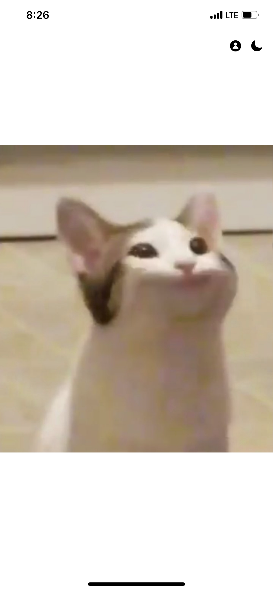

# PopCat

[![Swift Version][swift-image]](https://swift.org/)
[![Platform][Platform-image]](https://developer.apple.com/kr/ios/)
![Version][Version-image]

[swift-image]:https://img.shields.io/badge/swift-5.9-orange.svg?style=flat
[Platform-image]: https://img.shields.io/badge/Platform-iOS-lightgray.svg?style=flat
[Version-image]: https://img.shields.io/badge/Version-1.1-blue.svg?style=flat

## App View

    &nbsp;&nbsp;&nbsp;&nbsp;&nbsp;&nbsp;
    

## Feature
- iOS 17.0
- Combine
- Then

귀엽습니다.   
터치하면 Pop 소리를 냅니다.

